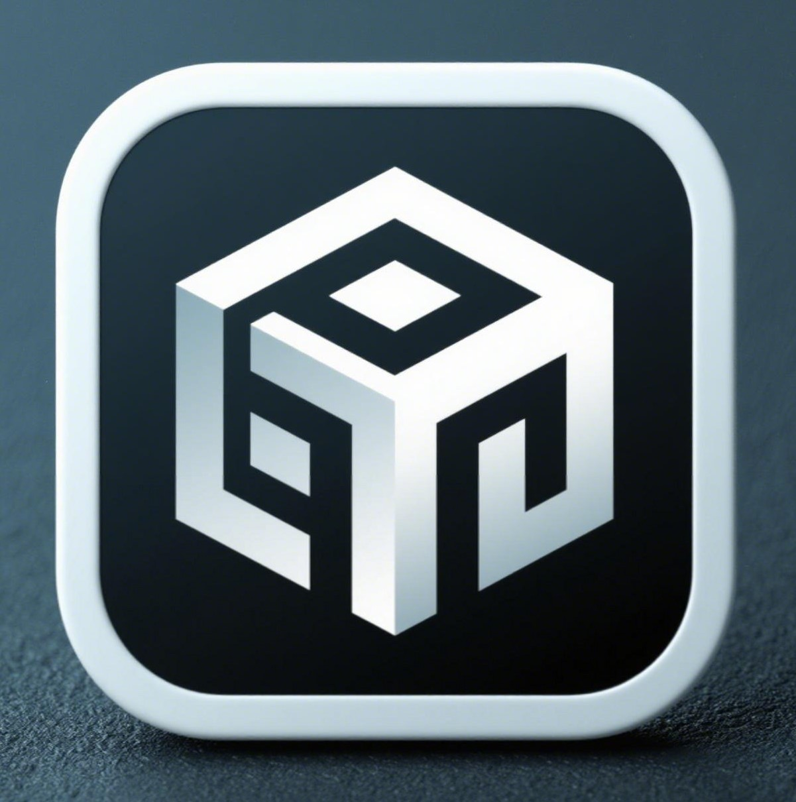

# ChatMath Mathematical Large Language Model
<div align="center">


  <div align="center">
    <b><font size="5">ChatMath</font></b>
  </div>


</div>

## 📝Table of Contents

- [📖 Overview](#-Overview)
- [🛠️ Operations](#%EF%B8%8F-Operations)
  * [Quick Start](#Quick Start)
  * [Re-training](#Re-training)
    + [Environment Setup](#Environment Setup)
    + [Fine-tuning](#Fine-tuning)
    + [Quantization](#Quantization)
    + [Evaluation](#Evaluation)
    + [Quantization and Evaluation](#Quantization and Evaluation)


## 📖 1 Overview

ChatMath is a large language model that integrates mathematical knowledge, exercises, and solutions. Based on InternLM2-Math-7B, this model uses a dataset that combines math exercise analyses and is fine-tuned with xtuner to specifically solve various math problems.  
If you think this project is great and helpful, you're welcome to click ⭐ Star to let more people discover this amazing project! 


## 🛠️ 2 Operations
### 2.1 Quick Start

Local Deployment

```bash
git clone https://github.com/linzz1921/ChatMath.git
python start.py
```

### 2.2 Re-training

#### 2.2.1 Environment Setup

1. Clone this project
```bash
git clone https://github.com/linzz1921/ChatMath.git
cd ChatMath
```

2. Create a virtual environment

```bash
conda env create -f environment.yml
conda activate ChatMath
pip install xtuner
```

#### 2.2.2 Fine-tuning

1. Prepare the configuration file

```bash
# List all built-in configurations
xtuner list-cfg
xtuner list-cfg

mkdir -p /root/chatmath/data
mkdir /root/chatmath/config && cd /root/chatmath/config

xtuner copy-cfg internlm2_chat_7b_qlora_oasst1_e3 .
```

2. Download the model


```bash
mkdir -p /root/chatmath/model
```

```python
import torch
from modelscope import snapshot_download, AutoModel, AutoTokenizer
import os
model_dir = snapshot_download('Shanghai_AI_Laboratory/internlm2-math-7b', cache_dir='/root/chatmath/model')
```


3. Modify the configuration file

A fine-tuning configuration file has been provided in the config folder of the repository. You can refer to internlm_chat_7b_qlora_oasst1_e3_copy.py.  
Here, you must modify the paths of pretrained_model_name_or_path and data_path.


```bash
cd /root/chatmath/config
vim internlm_chat_7b_qlora_oasst1_e3_copy.py
```

```python
# Modify the model to the local path
- pretrained_model_name_or_path = 'internlm/internlm-chat-7b'
+ pretrained_model_name_or_path = './internlm2-math-7b'

# Modify the training dataset to the local path
- data_path = 'timdettmers/openassistant-guanaco'
+ data_path = './data'
```

4. Start fine-tuning

```bash
xtuner train /root/math/config/internlm2_chat_7b_qlora_oasst1_e3_copy.py
```

5. Convert the PTH model to a HuggingFace model

```bash
mkdir hf
export MKL_SERVICE_FORCE_INTEL=1
export MKL_THREADING_LAYER=GNU
xtuner convert pth_to_hf ./internlm2_chat_7b_qlora_oasst1_e3_copy.py \
                         ./work_dirs/internlm2_chat_7b_qlora_oasst1_e3_copy/epoch_3.pth \
                         ./hf
```

6. Merge the HuggingFace model into the large language model
```bash
export NAME_OR_PATH_TO_LLM=/root/math/model/Shanghai_AI_Laboratory/internlm2-math-7b

export NAME_OR_PATH_TO_ADAPTER=/root/math/config/hf

mkdir /root/math/config/work_dirs/hf_merge
export SAVE_PATH=/root/math/config/work_dirs/hf_merge

xtuner convert merge \
    $NAME_OR_PATH_TO_LLM \
    $NAME_OR_PATH_TO_ADAPTER \
    $SAVE_PATH \
    --max-shard-size 2GB
```

7. Demo

```bash
streamlit run web_demo.py --server.address=0.0.0.0 --server.port 7860
```

#### Quantization

```shell
pip install -U lmdeploy
```

```shell
lmdeploy convert internlm2-chat-7b  Path_to_be_converted  --dst-path Path_after_conversion
```

```shell
lmdeploy chat turbomind Path_to_converted_turbomind_model
```
#### Evaluation

```shell
git clone https://github.com/open-compass/opencompass
cd opencompass
pip install -e .
```

```shell
cp /share/temp/datasets/OpenCompassData-core-20231110.zip /root/opencompass/
unzip OpenCompassData-core-20231110.zip
```

```shell
python run.py \
    --datasets math_gen \
    --hf-path Path_to_model \
    --tokenizer-path tokenizer \
    --tokenizer-kwargs padding_side='left' truncation='left'     trust_remote_code=True \
    --model-kwargs device_map='auto' trust_remote_code=True \
    --max-seq-len 2048 \
    --max-out-len 16 \
    --batch-size 2  \
    --num-gpus 1 \
    --debug
```
  
#### Quantization and Evaluation  

<details>
<summary><strong> W4 </strong> Quantization Evaluation </summary>

- `W4`Quantization
```shell
lmdeploy lite auto_awq Path_to_be_quantized --work-dir Path_after_quantization
```

- Convert to TurbMind
```shell
lmdeploy convert internlm2-chat-7b Path_after_quantization  --model-format awq --group-size 128 --dst-path Path_after_conversion
```

- Write the evaluation config

```python
from mmengine.config import read_base
from opencompass.models.turbomind import TurboMindModel

with read_base():
 # choose a list of datasets   
 from .datasets.ceval.ceval_gen import ceval_datasets 
 # and output the results in a choosen format
#  from .summarizers.medium import summarizer

datasets = [*ceval_datasets]

internlm2_chat_7b = dict(
     type=TurboMindModel,
     abbr='internlm2-chat-7b-turbomind',
     path='Path_after_conversion',
     engine_config=dict(session_len=512,
         max_batch_size=2,
         rope_scaling_factor=1.0),
     gen_config=dict(top_k=1,
         top_p=0.8,
         temperature=1.0,
         max_new_tokens=100),
     max_out_len=100,
     max_seq_len=512,
     batch_size=2,
     concurrency=1,
     #  meta_template=internlm_meta_template,
     run_cfg=dict(num_gpus=1, num_procs=1),
)
models = [internlm2_chat_7b]

```

```shell
python run.py configs/eval_turbomind.py -w Specify_path_to_save_results
```

</details>

<details>
<summary> <strong> KV Cache </strong> Quantization Evaluation </summary>

- Convert to TurbMind
```shell
lmdeploy convert internlm2-chat-7b  Path_to_model --dst-path Path_after_conversion
```
- Calculate and obtain quantization parameters
```shell
lmdeploy lite calibrate Path_to_model --calib-dataset 'ptb' --calib-samples 128 --calib-seqlen 2048 --work-dir Path_to_save_parameters
# Obtain quantization parameters
lmdeploy lite kv_qparams Path_to_save_parameters Path_to_converted_model/triton_models/weights/ --num-tp 1
```
- Change quant_policy to 4 and change the paths in the above config.
```shell
python run.py configs/eval_turbomind.py -w Path_to_save_results
```


